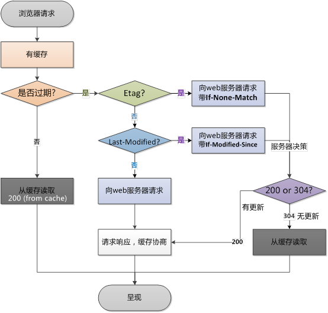
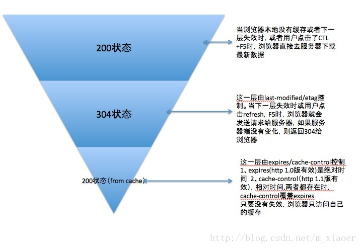

# `iris client side`(客户端缓存)
## 客户端缓存概述
### 浏览器缓存机制详解
#### `HTML Meta`标签控制缓存（非`HTTP`协议定义）
非`HTTP`协议定义的缓存机制，如使用`HTML Meta`标签，`Web`开发者可以在`HTML`页面的`<head>`节点中加入`<meta>`标签，代码如下:
```html
    <META HTTP-EQUIV="Pragma" CONTENT="no-cache">
```
上述代码的作用是告诉浏览器当前页面不被缓存，每次访问都需要去服务器拉取。使用上很简单，但只有部分浏览器可以支持，而且所有缓存代理服
务器都不支持，因为代理不解析`HTML`内容本身。而广泛应用的还是`HTTP`头信息 来控制缓存，下面我主要介绍`HTTP`协议定义的缓存机制
#### `HTTP`头信息控制缓存
- 浏览器第一次请求流程图

- 浏览器再次请求时

- 状态码的区别

#### 关于缓存的请求头说明
- `Expires`策略：`Expires`是`Web`服务器响应消息头字段，在响应`http`请求时告诉浏览器在过期时间前浏览器可以直接从浏览器缓存取数据，而无需再
次请求。不过`Expires`是`HTTP 1.0`的东西，现在默认浏览器均默认使用`HTTP 1.1`，所以它的作用基本忽略。`Expires`的一个缺点就是，返回的到期时
间是服务器端的时间，，用`GMT`格式的字符串表示，如：`Expires:Thu, 31 Dec 2016 23:55:55 GMT`。这样存在一个问题，如果客户端的时间与服
务器的时间相差很大（比如时钟不同步，或者跨时区），那么误差就很大，所以在`HTTP 1.1`版开始，使用`Cache-Control: max-age=`秒替代。
- `Cache-control`策略（重点关注）：`Cache-Control`与`Expires`的作用一致，都是指明当前资源的有效期，控制浏览器是否直接从浏览器缓存取数
据还是重新发请求到服务器取数据。只不过`Cache-Control`的选择更多，设置更细致，如果同时设置的话，其优先级高于`Expires`。读取缓存数据条件：
上次缓存时间（客户端的）+`max-age`< 当前时间（客户端的）。`Cache-Control`值可以是`public`、`private`、`no-cache`、`no- store`、
`no-transform`、`must-revalidate`、`proxy-revalidate`、`max-age`

| 字段名称 | 表示内容 |
| :--------: | :-----:|
| Public | 指示响应可被任何缓存区缓存 | 
| Private | 指示对于单个用户的整个或部分响应消息，不能被共享缓存处理。这允许服务器仅仅描述当前用户的部分响应消息，此响应消息对于其他用户的请求无效 | 
| no-cache | 指示请求或响应消息不能缓存，该选项并不是说可以设置”不缓存“，而是需要和服务器确认 |
| no-store | 在请求消息中发送将使得请求和响应消息都不使用缓存，完全不存下來 |
| max-age | 指示客户机可以接收生存期不大于指定时间（以秒为单位）的响应。上次缓存时间（客户端的）+max-age（64200s）<客户端当前时间 |
| min-fresh | 指示客户机可以接收响应时间小于当前时间加上指定时间的响应 |

> 提示：response header中，Expires和Cache-Control同时存在时，Cache-Control优先级高于Expires
- `Last-Modified/If-Modified-Since`：`Last-Modified/If-Modified-Since`要配合`Cache-Control`使用

| 字段名称 | 表示内容 |
| :--------: | :-----:|
| Last-Modified | 标示这个响应资源的最后修改时间.`web`服务器在响应请求时，告诉浏览器资源的最后修改时间 | 
| If-None-Match | 当资源过期时(使用`Cache-Control`标识的`max-age`),发现资源具有`Last-Modifie`d声明,则再次向`web`服务器请求时带上头`If-Modified-Since`,表示请求时间.`web`服务器收到请求后发现有头`If-Modified-Since`则与被请求资源的最后修改时间进行比对.若最后修改时间较新,说明资源又被改动过,则响应整片资源内容(写在响应消息包体内),`HTTP 200`;若最后修改时间较旧,说明资源无新修改,则响应`HTTP 304`(无需包体,节省浏览)，告知浏览器继续使用所保存的`cache` | 

- `Etag/If-None-Match`：`Etag/If-None-Match`也要配合`Cache-Control`使用

| 字段名称 | 表示内容 |
| :--------: | :-----:|
| Etag | `web`服务器响应请求时,告诉浏览器当前资源在服务器的唯一标识(生成规则由服务器决定).`Apache`中,`ETag`的值,默认是对文件的索引节(`INode`),大小(`Size`)和最后修改时间(`MTime`)进行`Hash`后得到的 | 
| If-None-Match | 当资源过期时(使用`Cache-Control`标识的`max-age`),发现资源具有`Etage`声明,则再次向`web`服务器请求时带上头`If-None-Match`(`Etag`的值).`web`服务器收到请求后发现有头`If-None-Match`则与被请求资源的相应校验串进行比对,决定返回`200`或`304` | 

> 既生`Last-Modified`何生`Etag`?你可能会觉得使用`Last-Modified`已经足以让客户端知道本地的缓存副本是否足够新,为什么还需要`Etag`(实体标识)呢?`HTTP1.1`中`Etag`的出现主要是为了解决几个`Last-Modified`比较难解决的问题:
1. `Last-Modified`标注的最后修改只能精确到秒级,如果某些文件在1秒钟以内,被修改多次的话,它将不能准确标注文件的修改时间
2. 如果某些文件会被定期生成,当有时内容并没有任何变化,但`Last-Modified`却改变了,导致文件没法使用缓存
3. 有可能存在服务器没有准确获取文件修改时间,或者与代理服务器时间不一致等情形
`Etag`是服务器自动生成或者由开发者生成的对应资源在服务器端的唯一标识符,能够更加准确的控制缓存.`Last-Modified`与`ETag`一起使用时,服务器会优先验证`ETag`
## 目录结构
> 主目录`clientSide`
```html
    —— main.go
```
## 代码示例 
> `main.go`
```go
//包main显示了如何使用`WriteWithExpiration`
//基于“modtime”，如果If-Modified-Since的时间将于之前的对比，如果超出了refreshEvery的范围
//它会刷新内容，否则会让客户端（99.9％的浏览器） 处理缓存机制，它比iris.Cache更快，因为服务器端
//如果没有任何操作，无需将响应存储在内存中。
package main

import (
	"time"
	"github.com/kataras/iris"
)

const refreshEvery = 10 * time.Second

func main() {
	app := iris.New()
	app.Use(iris.Cache304(refreshEvery))
	// 等同于
	// app.Use(func(ctx iris.Context) {
	// 	now := time.Now()
	// 	if modified, err := ctx.CheckIfModifiedSince(now.Add(-refresh)); !modified && err == nil {
	// 		ctx.WriteNotModified()
	// 		return
	// 	}
	// 	ctx.SetLastModified(now)
	// 	ctx.Next()
	// })
	app.Get("/", greet)
	app.Run(iris.Addr(":8080"))
}

func greet(ctx iris.Context) {
	ctx.Header("X-Custom", "my  custom header")
	ctx.Writef("Hello World! %s", time.Now())
}
```
## 提示
1. 运行上面代码,打开浏览器调试`network`工具,查看状态,status列,你会发现有时候是`200`有时候是`304`这就告诉你,何时是重新获取,何时是缓存
2. 也可以尝试在浏览器地址栏按回车、F5、Ctrl+F5刷新网页的区别，注意观察其中的状态