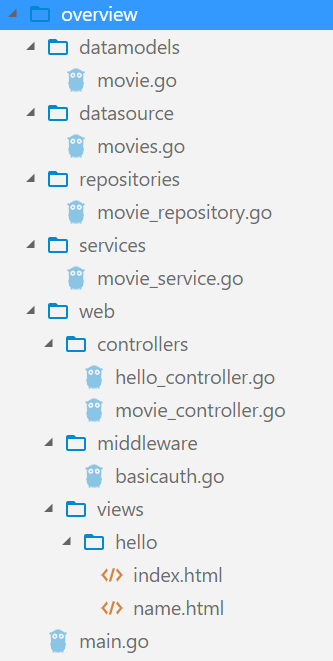

# `IRIS MVC overview`示例
## 目录结构
> 主目录`overview`

```html
    —— datamodels
        —— movie.go
    —— datasource
        —— movie.go
    —— main.go
    —— repositories
        —— movie_repository.go
    —— services
        —— movie_service.go
    —— web
        —— controllers
            —— hello_controller.go
            —— movie_controller.go
        —— middleware
            —— basicauth.go
        —— viewmodels
            —— README.md
        —— views
            —— hello
                —— index.html
                —— name.html
```
## 代码示例
> `main.go`

```go
//文件：main.go
package main

import (
	"./datasource"
	"./repositories"
	"./services"
	"./web/controllers"
	"./web/middleware"
	"github.com/kataras/iris"
	"github.com/kataras/iris/mvc"
)

func main() {
	app := iris.New()
	app.Logger().SetLevel("debug")
	//加载模板文件
	app.RegisterView(iris.HTML("./web/views", ".html"))
	//服务控制器
	mvc.New(app.Party("/hello")).Handle(new(controllers.HelloController))
	//您还可以拆分您编写的代码以配置mvc.Application
	//使用`mvc.Configure`方法，如下所示。
	mvc.Configure(app.Party("/movies"), movies)
	// http://localhost:8080/hello
	// http://localhost:8080/hello/iris
	// http://localhost:8080/movies
	// http://localhost:8080/movies/1
	app.Run(
		//在localhost：8080启动Web服务器
		iris.Addr("localhost:8080"),
		//按下CTRL/CMD+C时跳过错误的服务器：
		iris.WithoutServerError(iris.ErrServerClosed),
		//启用更快的json序列化和优化：
		iris.WithOptimizations,
	)
}

//注意mvc.Application，它不是iris.Application。
func movies(app *mvc.Application) {
	//添加基本身份验证（admin：password）中间件
	//用于基于/movies的请求。
	app.Router.Use(middleware.BasicAuth)
	//使用数据源中的一些（内存）数据创建我们的电影资源库。
	repo := repositories.NewMovieRepository(datasource.Movies)
	//创建我们的电影服务，我们将它绑定到电影应用程序的依赖项中
	movieService := services.NewMovieService(repo)
	app.Register(movieService)
	//为我们的电影控制器服务
	//请注意，您可以为多个控制器提供服务
	//你也可以使用`movies.Party（relativePath）`或`movies.Clone（app.Party（...））创建子mvc应用程序
	// 如果你想。
	app.Handle(new(controllers.MovieController))
}
```
> `/datamodels/movie.go`

```go
//文件: datamodels/movie.go
package datamodels

//Movie是我们的示例数据结构。
//注意结构体字段可导出
//应该保存在其他文件中，例如web/viewmodels/movie.go
//可以通过嵌入datamodels.Movie或 声明新字段但我们将使用此数据模型
//作为我们应用程序中唯一的一个Movie模型，为了不冲突。
type Movie struct {
	ID     int64  `json:"id"`
	Name   string `json:"name"`
	Year   int    `json:"year"`
	Genre  string `json:"genre"`
	Poster string `json:"poster"`
}
```
> `/datasource/movie.go`

```go
//文件: datasource/movies.go
package datasource

import "../datamodels"
//Movies是我们想象中的数据源。
var Movies = map[int64]datamodels.Movie{
	1: {
		ID:     1,
		Name:   "Casablanca",
		Year:   1942,
		Genre:  "Romance",
		Poster: "https://iris-go.com/images/examples/mvc-movies/1.jpg",
	},
	2: {
		ID:     2,
		Name:   "Gone with the Wind",
		Year:   1939,
		Genre:  "Romance",
		Poster: "https://iris-go.com/images/examples/mvc-movies/2.jpg",
	},
	3: {
		ID:     3,
		Name:   "Citizen Kane",
		Year:   1941,
		Genre:  "Mystery",
		Poster: "https://iris-go.com/images/examples/mvc-movies/3.jpg",
	},
	4: {
		ID:     4,
		Name:   "The Wizard of Oz",
		Year:   1939,
		Genre:  "Fantasy",
		Poster: "https://iris-go.com/images/examples/mvc-movies/4.jpg",
	},
	5: {
		ID:     5,
		Name:   "North by Northwest",
		Year:   1959,
		Genre:  "Thriller",
		Poster: "https://iris-go.com/images/examples/mvc-movies/5.jpg",
	},
}
```
> `/repositories/movie_repository.go`

```go
//文件: repositories/movie_repository.go
package repositories

import (
	"errors"
	"sync"
	"../datamodels"
)
// Query表示访问者和操作查询
type Query func(datamodels.Movie) bool

// MovieRepository处理电影实体/模型的基本操作。
//它是一个可测试的接口，即一个内存电影库或连接到sql数据库。
type MovieRepository interface {
	Exec(query Query, action Query, limit int, mode int) (ok bool)

	Select(query Query) (movie datamodels.Movie, found bool)
	SelectMany(query Query, limit int) (results []datamodels.Movie)

	InsertOrUpdate(movie datamodels.Movie) (updatedMovie datamodels.Movie, err error)
	Delete(query Query, limit int) (deleted bool)
}

//NewMovieRepository返回一个新的基于电影内存的repository，
//我们示例中唯一的repository类型。
func NewMovieRepository(source map[int64]datamodels.Movie) MovieRepository {
	return &movieMemoryRepository{source: source}
}

// movieMemoryRepository是一个MovieRepository
//使用内存数据源（map）管理电影。
type movieMemoryRepository struct {
	source map[int64]datamodels.Movie
	mu     sync.RWMutex
}

const (
	// ReadOnlyMode将RLock（读取）数据。
	ReadOnlyMode = iota
	// ReadWriteMode将锁定（读/写）数据。
	ReadWriteMode
)

func (r *movieMemoryRepository) Exec(query Query, action Query, actionLimit int, mode int) (ok bool) {
	loops := 0
	if mode == ReadOnlyMode {
		r.mu.RLock()
		defer r.mu.RUnlock()
	} else {
		r.mu.Lock()
		defer r.mu.Unlock()
	}
	for _, movie := range r.source {
		ok = query(movie)
		if ok {
			if action(movie) {
				loops++
				if actionLimit >= loops {
					break // break
				}
			}
		}
	}
	return
}

//Select接收查询函数
//为内部的每个电影模型触发
//我们想象中的数据源
//当该函数返回true时，它会停止迭代

//它实际上是一个简单但非常聪明的原型函数
//自从我第一次想到它以来，我一直在使用它，
//希望你会发现它也很有用。
func (r *movieMemoryRepository) Select(query Query) (movie datamodels.Movie, found bool) {
	found = r.Exec(query, func(m datamodels.Movie) bool {
		movie = m
		return true
	}, 1, ReadOnlyMode)
	//设置一个空的datamodels.Movie，如果根本找不到的话。
	if !found {
		movie = datamodels.Movie{}
	}
	return
}

// SelectMany与Select相同但返回一个或多个datamodels.Movie作为切片。
//如果limit <= 0则返回所有内容。
func (r *movieMemoryRepository) SelectMany(query Query, limit int) (results []datamodels.Movie) {
	r.Exec(query, func(m datamodels.Movie) bool {
		results = append(results, m)
		return true
	}, limit, ReadOnlyMode)
	return
}

// InsertOrUpdate将movie添加或更新到map中存储。
//返回新电影，如果有则返回错误。
func (r *movieMemoryRepository) InsertOrUpdate(movie datamodels.Movie) (datamodels.Movie, error) {
	id := movie.ID
	if id == 0 { // Create new action  //创建新记录
		var lastID int64
		//找到最大的ID，以便不重复
		//在制作应用中，您可以使用第三方
		//库以生成UUID作为字符串。
		r.mu.RLock()
		for _, item := range r.source {
			if item.ID > lastID {
				lastID = item.ID
			}
		}
		r.mu.RUnlock()
		id = lastID + 1
		movie.ID = id
		// map-specific thing
		r.mu.Lock()
		r.source[id] = movie
		r.mu.Unlock()
		return movie, nil
	}
	//基于movie.ID更新动作，
	//这里我们将允许更新海报和流派，如果不是空的话。
	//或者我们可以做替换：
	// r.source [id] =movie
	//向下面的代码一样;
	current, exists := r.Select(func(m datamodels.Movie) bool {
		return m.ID == id
	})
	if !exists { // ID不是真实的，返回错误。
		return datamodels.Movie{}, errors.New("failed to update a nonexistent movie")
	}
	//或注释这些和r.source[id] = m进行纯替换
	if movie.Poster != "" {
		current.Poster = movie.Poster
	}
	if movie.Genre != "" {
		current.Genre = movie.Genre
	}
	//锁定数据
	r.mu.Lock()
	r.source[id] = current
	r.mu.Unlock()
	return movie, nil
}

func (r *movieMemoryRepository) Delete(query Query, limit int) bool {
	return r.Exec(query, func(m datamodels.Movie) bool {
		delete(r.source, m.ID)
		return true
	}, limit, ReadWriteMode)
}
```
> `/services/movie_service.go`

```go
// 文件: services/movie_service.go
package services

import (
	"../datamodels"
	"../repositories"
)
//MovieService处理电影数据模型的一些CRUID操作。
//这依赖于影片repository的方法。
//这是将数据源与更高级别的组件分离。
//因此，不同的repository类型可以使用相同的逻辑，而无需任何更改。
//它是一个接口，它在任何地方都被用作接口
//因为我们可能需要在将来更改或尝试实验性的不同域逻辑。
type MovieService interface {
	GetAll() []datamodels.Movie
	GetByID(id int64) (datamodels.Movie, bool)
	DeleteByID(id int64) bool
	UpdatePosterAndGenreByID(id int64, poster string, genre string) (datamodels.Movie, error)
}

// NewMovieService返回默认的movie service
func NewMovieService(repo repositories.MovieRepository) MovieService {
	return &movieService{
		repo: repo,
	}
}

type movieService struct {
	repo repositories.MovieRepository
}

// GetAll返回所有电影
func (s *movieService) GetAll() []datamodels.Movie {
	return s.repo.SelectMany(func(_ datamodels.Movie) bool {
		return true
	}, -1)
}

// GetByID根据其id返回一部电影
func (s *movieService) GetByID(id int64) (datamodels.Movie, bool) {
	return s.repo.Select(func(m datamodels.Movie) bool {
		return m.ID == id
	})
}

// UpdatePosterAndGenreByID更新电影的海报和流派。
func (s *movieService) UpdatePosterAndGenreByID(id int64, poster string, genre string) (datamodels.Movie, error) {
	//更新电影并将其返回。
	return s.repo.InsertOrUpdate(datamodels.Movie{
		ID:     id,
		Poster: poster,
		Genre:  genre,
	})
}

// DeleteByID按ID删除电影。
//如果删除则返回true，否则返回false。
func (s *movieService) DeleteByID(id int64) bool {
	return s.repo.Delete(func(m datamodels.Movie) bool {
		return m.ID == id
	}, 1)
}
```

> `/web/controllers/hello_controller.go`

```go
//文件: web/controllers/hello_controller.go
package controllers

import (
	"errors"
	"github.com/kataras/iris/mvc"
)

// HelloController是我们的示例控制器
//它处理 GET：/hello和GET：/hello/{name}
type HelloController struct{}

var helloView = mvc.View{
	Name: "hello/index.html",
	Data: map[string]interface{}{
		"Title":     "Hello Page",
		"MyMessage": "Welcome to my awesome website",
	},
}
//Get将返回带有绑定数据的预定义视图
//`mvc.Result`只是一个带有'Dispatch`功能的接口。
//`mvc.Response`和`mvc.View`是内置的结果类型调度程序
//你甚至可以创建自定义响应调度程序
//实现`github.com/kataras/iris/hero＃Result`接口。
func (c *HelloController) Get() mvc.Result {
	return helloView
}

//您可以定义标准错误，以便在应用中的任何位置重复使用
var errBadName = errors.New("bad name")

//您可以将其作为错误返回
//使用mvc.Response包装此错误，使其成为mvc.Result兼容类型。
var badName = mvc.Response{Err: errBadName, Code: 400}

// GetBy 返回 "Hello {name}" response.
// 示例:
// curl -i http://localhost:8080/hello/iris
// curl -i http://localhost:8080/hello/anything
func (c *HelloController) GetBy(name string) mvc.Result {
	if name != "iris" {
		return badName
		// 或
		// GetBy(name string) (mvc.Result, error) {
		//	return nil, errBadName
		// }
	}
	// return mvc.Response{Text: "Hello " + name} 或:
	return mvc.View{
		Name: "hello/name.html",
		Data: name,
	}
}
```
> `/web/controllers/movie_controller.go`

```go
// 文件: web/controllers/movie_controller.go
package controllers

import (
	"errors"
	"../../datamodels"
	"../../services"
	"github.com/kataras/iris"
)
// MovieController是我们的/movies controller。
type MovieController struct {
	//我们的MovieService，它是一个接口，从主应用程序绑定。
	Service services.MovieService
}

//获取电影的返回列表。
// 示例:
// curl -i http://localhost:8080/movies
//
// func (c *MovieController) Get() (results []viewmodels.Movie) {
// 	data := c.Service.GetAll()
// 	for _, movie := range data {
// 		results = append(results, viewmodels.Movie{movie})
// 	}
// 	return
// }
//否则只返回数据模型
func (c *MovieController) Get() (results []datamodels.Movie) {
	return c.Service.GetAll()
}

// MovieByID返回指定id的一部电影
// 例子:
// curl -i http://localhost:8080/movies/1
func (c *MovieController) GetBy(id int64) (movie datamodels.Movie, found bool) {
	return c.Service.GetByID(id) // it will throw 404 if not found.
}

// PutBy 更新指点电影数据.
// 例子:
// curl -i -X PUT -F "genre=Thriller" -F "poster=@/Users/kataras/Downloads/out.gif" http://localhost:8080/movies/1
func (c *MovieController) PutBy(ctx iris.Context, id int64) (datamodels.Movie, error) {
	// get the request data for poster and genre
	file, info, err := ctx.FormFile("poster")
	if err != nil {
		return datamodels.Movie{}, errors.New("failed due form file 'poster' missing")
	}
	//关闭文件。
	file.Close()
	//想象这是上传文件的网址...
	poster := info.Filename
	genre := ctx.FormValue("genre")
	return c.Service.UpdatePosterAndGenreByID(id, poster, genre)
}

// DeleteBy删除电影。
// 例子:
// curl -i -X DELETE -u admin:password http://localhost:8080/movies/1
func (c *MovieController) DeleteBy(id int64) interface{} {
	wasDel := c.Service.DeleteByID(id)
	if wasDel {
		//返回已删除电影的ID
		return iris.Map{"deleted": id}
	}
	//在这里我们可以看到方法函数可以返回这两种类型中的任何一种（map或int），
	//我们不必将返回类型指定为特定类型。
	return iris.StatusBadRequest
}
```
> `/web/middleware/basicauth.go`

```go
//文件: web/middleware/basicauth.go
package middleware

import "github.com/kataras/iris/middleware/basicauth"

// BasicAuth中间件示例。
var BasicAuth = basicauth.New(basicauth.Config{
	Users: map[string]string{
		"admin": "password",
	},
})
```
> `/web/views/hello/index.html`

```html
<!-- 文件: web/views/hello/index.html -->
<html>
<head>
    <title>{{.Title}} - My App</title>
</head>
<body>
    <p>{{.MyMessage}}</p>
</body>
</html>
```
> `/web/views/name.go`

```html
<!-- 文件: web/views/hello/name.html -->
<html>
<head>
    <title>{{.}}' Portfolio - My App</title>
</head>
<body>
    <h1>Hello {{.}}</h1>
</body>
</html>
```
